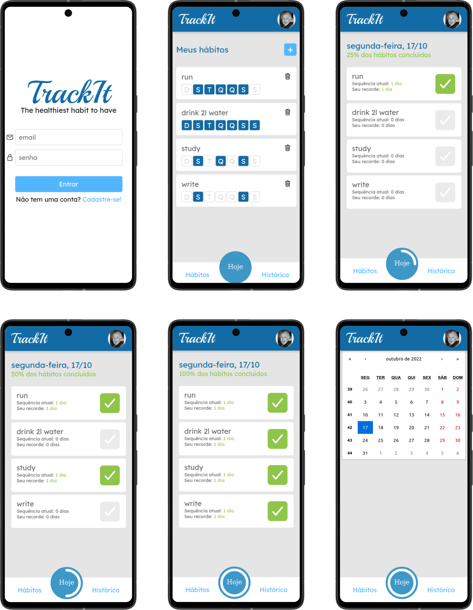

<p align="center">
  <a href="https://cineflix-rose.vercel.app/">
 </a>
</p>

<h3 align="center">Zaprecall</h3>

<div align="center">

[]()
[](https://github.com//raferdev/cineflix/issues)
[](https://github.com/raferdev/cineflix/pulls)
[](/LICENSE)

</div>

---



---
<p align="center"> This project is 
</p>

## 📝 Table of Contents

- [About](#about)
- [Getting Started](#getting_started)
- [Usage](#usage)
- [Built Using](#built_using)
- [Authors](#authors)

## 🧐 About <a name = "about"></a>

This project is based on sites of reserving seats at movie sessions. Is build in ReactJS and use one API to check and reserve seats, you can see all movies and click on them to select the best day and hour to reserve your seats.

## 🏁 Getting Started <a name = "getting_started"></a>

You can clone the project and start on your local host or open the site hospeded <a href="https://cineflix-rose.vercel.app/">here</a>

Clone

 ```
 git clone https://github.com/raferdev/cineflix
 ```
Install Dependencies


```
npm i
```
Start Server
```
npm start
```
The browser will remote open on the local link on port 3000 (usually). Exemple .:
```
http://localhost:3000
```

## 🎈 Usage <a name="usage"></a>

- The API will return all of open movies.
- You can select which you prefeer.
- You will see all the dates to reserve.
- Select the best date.
- You will see the seats, the open seats will apear in blue, and you can select them to reserve.
- Complete the form to finish your reservation.
- Good session.

## ⛏️ Built Using <a name = "built_using"></a>

- [HTML](https://developer.mozilla.org/pt-BR/docs/Web/HTML) - Markup Language
- [CSS](https://developer.mozilla.org/pt-BR/docs/Web/CSS) - Style Language
- [JS](https://developer.mozilla.org/pt-BR/docs/Web/javascript) - Interative Language
- [ReactJS](https://pt-br.reactjs.org/) - Javascript Super Library

## ✍️ Authors <a name = "authors"></a>

- [@raferdev](https://github.com/raferdev)
