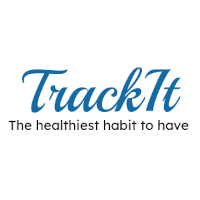

<p align="center">
  <a href="https://projeto10-trackit-psi.vercel.app/login">
 </a>
</p>

<h3 align="center">Trackit</h3>

<div align="center">

[]()
[](https://github.com//raferdev/trackit/issues)
[](https://github.com/raferdev/trackit/pulls)
[](/LICENSE)

</div>

---


---
<p align="center"> This is a app created to improve your control of routine activities. You can list your semanal pratices, set the days and see which one of these are to make today, check them and see the progress bar. If you check all the activities on a day, this day count in sprint to register new record.
</p>

## 📝 Table of Contents

- [About](#about)
- [Getting Started](#getting_started)
- [Usage](#usage)
- [Built Using](#built_using)
- [Authors](#authors)

## 🧐 About <a name = "about"></a>

This project is one app which consist on the control of personal activities, like run, gym, study, etc, on a week. It can help and improve the user control to finish her objectives. Its maked in ReactJS and a fel number of libs to makes more interactive.

## 🏁 Getting Started <a name = "getting_started"></a>

You can clone the project and start on your local host or open the site hospeded <a href="https://projeto10-trackit-psi.vercel.app/login">here</a>

Clone

 ```
 git clone https://github.com/raferdev/trackit
 ```
Install Dependencies


```
npm i
```
Start Server
```
npm start
```
The browser will remote open on the local link on port 3000 (usually). Exemple .:
```
http://localhost:3000
```

## 🎈 Usage <a name="usage"></a>

- First you click on "Cadastre-se" to sign-up on app. You will need one image link to do this.
- If its all ok you will be redirected to login page, and you can use the email and password added previously.
- Now you see the app and can click on "Habitos" to create new Habits to track.
- You will see an empy page and on the top one plus icon which you can click to describe your habit and the days you want to track.
- Also if its added you can click on "Hoje", and if you have one habit today its will be visible on there.
- You can check your habits when you complete them by click on the check icon and the API will receive this data to store and know your bests sprints.
- On "Histórico" you can click to see on different colors days who you got it(100% of habits) or not.
## ⛏️ Built Using <a name = "built_using"></a>

- [HTML](https://developer.mozilla.org/pt-BR/docs/Web/HTML) - Markup Language
- [CSS](https://developer.mozilla.org/pt-BR/docs/Web/CSS) - Style Language
- [JS](https://developer.mozilla.org/pt-BR/docs/Web/javascript) - Interative Language
- [ReactJS](https://pt-br.reactjs.org/) - Javascript Super Library

## ✍️ Authors <a name = "authors"></a>

- [@raferdev](https://github.com/raferdev)
